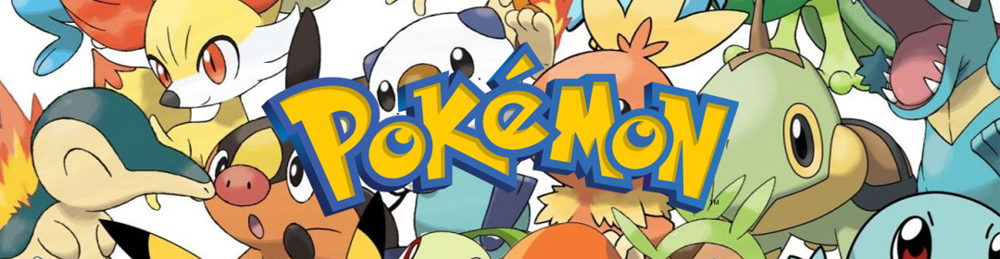

<h1 class="titulo">Pokedex</h1>

Projeto desenvolvido pelo canal Manual do Dev que tem como finalidade criar uma réplica de uma pokedex responsiva que é alimentada através do uso da PokeApi. Mais informações sobre o desenvolvimento estão expostas abaixo.

 
<h2 class="subtit">👷‍ - Habilidades Desenvolvidas</h2>
 

✅ Desenvolvimento de layout responsivo

✅ Consumo de API

✅ CSS Moderno

 
<h2 class="subtit">🛠 - Tecnologia Utilizadas</h2>
 

    
    
    

 
<h2 class="subtit">🔗 - Deploy</h2>
 

Acesse o projeto desenvolvido por mim através deste <a href="https://antlacerda.github.io/Pokedex.github.io/">link</a>.

